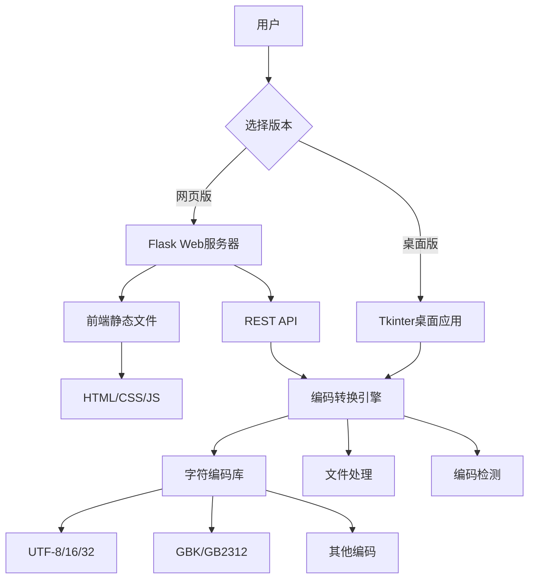
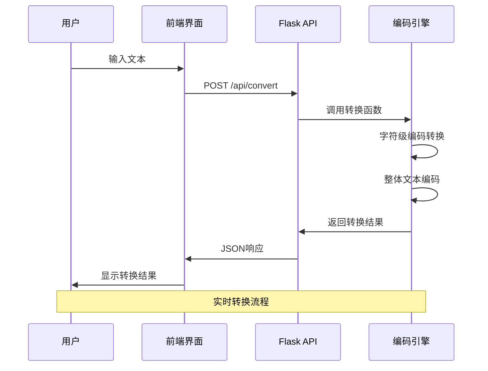
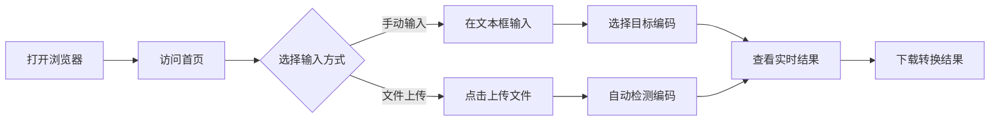
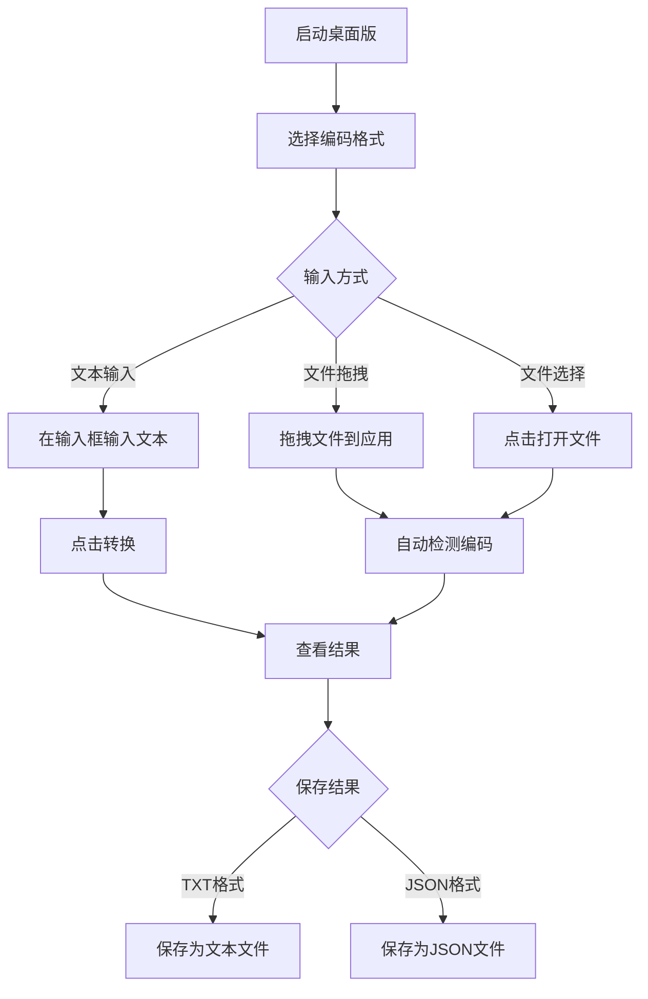

# ✨ 字符编码转换器 Pro

一个现代化的字符编码转换工具，提供网页版和桌面版两种使用方式，支持多种字符编码格式的实时转换。


## 📋 目录

- [🌟 主要特性](#-主要特性)
- [🏗️ 项目架构](#️-项目架构)
- [🚀 快速开始](#-快速开始)
- [🐳 Docker部署](#-docker部署)
- [📖 详细使用说明](#-详细使用说明)
- [🔧 API文档](#-api文档)
- [💻 开发指南](#-开发指南)
- [🐛 故障排除](#-故障排除)

## 🌟 主要特性

### 🌐 网页版特性
- 🎨 **现代化设计** - 响应式界面，支持深色模式
- 🔄 **实时转换** - 输入文本时即时显示编码结果
- 📁 **文件支持** - 支持文件上传和结果下载
- 🎯 **多编码支持** - 支持30+种字符编码格式
- 💾 **历史记录** - 保存转换历史便于查看
- 📱 **移动适配** - 完美支持手机和平板设备
- 🌙 **主题切换** - 深色/浅色主题自由切换

### 🖥️ 桌面版特性
- 🎨 **原生界面** - 基于Tkinter的原生桌面应用
- ⚡ **离线使用** - 无需网络连接即可使用
- 📂 **批量处理** - 支持批量文件编码转换
- 🔍 **智能检测** - 自动检测文件编码格式
- 💾 **格式导出** - 支持TXT、JSON等多种导出格式
- 🎯 **拖拽支持** - 拖拽文件即可快速转换

## 🏗️ 项目架构

### 系统架构图



### 技术栈

#### 后端技术
- **Python 3.7+** - 主要开发语言
- **Flask** - Web框架，提供API和静态文件服务
- **Flask-CORS** - 跨域资源共享支持
- **chardet** - 字符编码检测库
- **unicodedata** - Unicode字符信息处理

#### 前端技术
- **HTML5** - 语义化标记
- **CSS3** - 现代样式，包括Flexbox、Grid、动画
- **Vanilla JavaScript** - 原生JS，无框架依赖
- **响应式设计** - 适配各种设备屏幕

#### 桌面端技术
- **Tkinter** - Python标准GUI库
- **ttk** - 主题化控件
- **ScrolledText** - 文本滚动组件

#### 部署技术
- **Docker** - 容器化部署
- **Docker Compose** - 多容器编排
- **Nginx** - 反向代理（可选）

### 数据流程图



## 🚀 快速开始

### 方法一：使用主启动器（推荐）

```bash
# 克隆项目
git clone https://github.com/your-repo/encoding-converter-pro.git
cd encoding-converter-pro

# 安装依赖
pip install -r requirements.txt

# 运行主启动器
python start.py
```

然后根据菜单选择：
1. 🌐 **网页版** - 现代化Web界面
2. 🖥️ **桌面版** - 原生桌面应用
3. 🔧 **环境检查** - 诊断系统环境

### 方法二：分别启动

#### 启动网页版
```bash
# 启动集成的Flask服务器（包含前端和API）
python backend/app.py

# 浏览器访问
open http://localhost:5000
```

#### 启动桌面版
```bash
python start_desktop.py
```

## 🐳 Docker部署

### 基础部署

```bash
# 构建镜像
docker build -t encoding-converter-pro .

# 运行容器
docker run -d \
  --name encoding-converter \
  -p 5000:5000 \
  encoding-converter-pro
```

### 使用Docker Compose

```bash
# 启动服务
docker-compose up -d

# 查看日志
docker-compose logs -f

# 停止服务
docker-compose down
```

### 生产环境部署（带Nginx）

```bash
# 启动包含Nginx的完整环境
docker-compose --profile production up -d
```

## 📁 项目结构

```
encoding_converter/
├── 📄 README.md                  # 项目说明文档
├── 📄 requirements.txt           # Python依赖包
├── 📄 Dockerfile                 # Docker构建文件
├── 📄 docker-compose.yml         # Docker编排文件
├── 📄 .dockerignore               # Docker忽略文件
├── 📄 start.py                    # 🎯 主启动器
├── 📄 start_web.py               # 🌐 网页版启动器
├── 📄 start_desktop.py           # 🖥️ 桌面版启动器
├── 🗂️ backend/                   # 后端服务
│   └── 📄 app.py                 # Flask应用（集成前端）
├── 🗂️ frontend/                  # 前端文件
│   ├── 📄 index.html             # 主页面
│   ├── 📄 styles.css             # 样式文件
│   └── 📄 script.js              # JavaScript代码
└── 🗂️ desktop/                   # 桌面版
    ├── 📄 encoding_converter_tkinter.py
    └── 📄 encoding_converter_pyqt6.py
```

## 🎯 支持的编码格式

| 编码类型 | 支持的格式 | 描述 |
|---------|-----------|------|
| **Unicode** | UTF-8, UTF-16 (LE/BE), UTF-32 (LE/BE) | 国际标准Unicode编码 |
| **中文** | GBK, GB2312, GB18030, Big5 | 简体和繁体中文编码 |
| **日文** | Shift_JIS, EUC-JP, ISO-2022-JP | 日语字符编码 |
| **韩文** | EUC-KR, CP949, ISO-2022-KR | 韩语字符编码 |
| **西欧** | ASCII, Latin-1, CP1252, ISO-8859-1/15 | 西欧语言编码 |
| **俄文** | KOI8-R, CP1251, ISO-8859-5 | 俄语字符编码 |
| **其他** | CP437, CP850, CP866 | 其他字符编码 |

## 📖 详细使用说明

### 网页版使用流程



#### 详细操作步骤
1. **文本输入**
   - 在主文本框中输入要转换的文本
   - 支持实时转换，输入时即可看到结果
   - 字符计数器显示当前字符数

2. **编码选择**
   - 勾选需要转换的目标编码格式
   - 支持多选，可同时查看多种编码结果
   - 默认选择常用编码格式

3. **结果查看**
   - **字符视图**: 逐字符显示编码信息
   - **十六进制**: 以十六进制显示编码结果
   - **Base64**: 以Base64格式显示
   - **统计信息**: 显示字符数、字节数等

4. **文件操作**
   - **上传文件**: 支持文本文件自动编码检测
   - **下载结果**: 将转换结果保存为文件

### 桌面版使用流程



## 🔧 API文档

### API端点列表

| 端点 | 方法 | 描述 | 参数 |
|------|------|------|------|
| `/` | GET | 主页面 | 无 |
| `/api/health` | GET | 健康检查 | 无 |
| `/api/encodings` | GET | 获取支持的编码列表 | 无 |
| `/api/convert` | POST | 文本编码转换 | `text`, `encodings` |
| `/api/detect` | POST | 编码检测 | `text` |
| `/api/upload` | POST | 文件上传 | `file` |

### API使用示例

#### 1. 文本编码转换

```bash
curl -X POST http://localhost:5000/api/convert \
  -H "Content-Type: application/json" \
  -d '{
    "text": "Hello 世界",
    "encodings": ["utf-8", "gbk", "utf-16"]
  }'
```

**响应示例:**
```json
{
  "success": true,
  "results": {
    "overall": {
      "utf-8": {
        "success": true,
        "hex": "48656C6C6F20E4B896E7958C",
        "length": 11
      }
    },
    "characters": [...],
    "stats": {
      "length": 7,
      "unique_chars": 7
    }
  }
}
```

#### 2. 编码检测

```bash
curl -X POST http://localhost:5000/api/detect \
  -H "Content-Type: application/json" \
  -d '{"text": "测试文本"}'
```

#### 3. 文件上传

```bash
curl -X POST http://localhost:5000/api/upload \
  -F "file=@example.txt"
```

## 💻 开发指南

### 开发环境搭建

```bash
# 1. 克隆项目
git clone https://github.com/your-repo/encoding-converter-pro.git
cd encoding-converter-pro

# 2. 创建虚拟环境
python -m venv venv
source venv/bin/activate  # Linux/Mac
# 或
venv\Scripts\activate     # Windows

# 3. 安装依赖
pip install -r requirements.txt

# 4. 启动开发服务器
python backend/app.py
```

### 开发流程

```mermaid
gitgraph
    commit id: "初始项目"
    branch feature/web-ui
    checkout feature/web-ui
    commit id: "创建HTML结构"
    commit id: "添加CSS样式"
    commit id: "实现JS交互"
    checkout main
    merge feature/web-ui
    branch feature/api
    checkout feature/api
    commit id: "设计API接口"
    commit id: "实现编码转换"
    commit id: "添加文件上传"
    checkout main
    merge feature/api
    branch feature/desktop
    checkout feature/desktop
    commit id: "创建Tkinter界面"
    commit id: "实现桌面功能"
    checkout main
    merge feature/desktop
    commit id: "集成测试"
    commit id: "Docker化部署"
```

### 项目开发历程

#### 阶段一：基础架构设计
- 📋 **需求分析**: 确定支持网页版和桌面版
- 🏗️ **架构设计**: 采用前后端分离架构
- 🛠️ **技术选型**: Flask + Vanilla JS + Tkinter

#### 阶段二：后端API开发
- 🔧 **API设计**: RESTful风格的编码转换API
- 💾 **数据处理**: 字符级和文本级编码转换
- 🔍 **编码检测**: 集成chardet库实现智能检测

#### 阶段三：前端界面开发
- 🎨 **UI设计**: 现代化响应式界面
- ⚡ **实时交互**: 实现输入时即时转换
- 📱 **移动适配**: 完美支持移动设备

#### 阶段四：桌面版开发
- 🖥️ **桌面界面**: 基于Tkinter的原生应用
- 📂 **文件处理**: 支持拖拽和批量处理
- 💾 **数据导出**: 多格式结果保存

#### 阶段五：集成和部署
- 🐳 **Docker化**: 容器化部署支持
- 🔧 **启动器**: 统一的启动管理工具
- 📖 **文档完善**: 详细的使用和开发文档

### 代码结构说明

#### 后端架构
```python
# Flask应用结构
app/
├── routes/          # 路由定义
├── services/        # 业务逻辑
├── utils/           # 工具函数
└── models/          # 数据模型
```

#### 前端架构
```javascript
// 前端模块化结构
frontend/
├── components/      # UI组件
├── services/        # API服务
├── utils/           # 工具函数
└── styles/          # 样式文件
```

### 性能优化

#### 后端优化
- ⚡ **异步处理**: 大文件处理使用异步IO
- 🗄️ **缓存机制**: 常用编码转换结果缓存
- 📊 **分页加载**: 大量字符时分页显示

#### 前端优化
- 🎯 **懒加载**: 按需加载编码结果
- 💾 **本地存储**: 设置和历史记录本地保存
- 🔄 **防抖动**: 输入防抖减少API调用

## 🐛 故障排除

### 常见问题

#### 1. PyQt6 DLL加载错误
**症状**: 启动桌面版时出现DLL加载失败
```bash
ImportError: DLL load failed while importing QtCore
```

**解决方案**:
```bash
# 使用Tkinter版本替代
python desktop/encoding_converter_tkinter.py

# 或重新安装PyQt6
pip uninstall PyQt6
pip install PyQt6
```

#### 2. 网页版404错误
**症状**: 访问网页时显示404
**解决方案**: 确保Flask服务器正在运行
```bash
python backend/app.py
```

#### 3. 端口占用问题
**症状**: 端口5000被占用
```bash
OSError: [Errno 98] Address already in use
```

**解决方案**:
```bash
# 查找占用端口的进程
lsof -i :5000

# 修改端口号
# 在app.py中修改: app.run(port=5001)
```

#### 4. 编码检测不准确
**症状**: 自动检测的编码格式不正确
**解决方案**: 
- 手动指定编码格式
- 尝试多种编码格式对比
- 检查文件是否包含BOM标记

### 环境检查工具

运行环境诊断来快速定位问题：
```bash
python start.py
# 选择选项3进行环境检查
```

检查内容包括：
- ✅ Python版本兼容性
- ✅ 必需依赖包安装情况
- ✅ 项目文件完整性
- ✅ 端口可用性

## 🤝 贡献指南

我们欢迎各种形式的贡献！

### 贡献方式
1. 🐛 **报告Bug** - 提交Issue描述问题
2. 💡 **功能建议** - 提出新功能想法
3. 📝 **改进文档** - 完善使用说明
4. 💻 **提交代码** - Pull Request代码改进

### 开发规范
- 📋 遵循PEP 8代码风格
- 🧪 添加单元测试
- 📖 更新相关文档
- 🔍 代码review通过

### Pull Request流程
1. Fork项目到个人仓库
2. 创建功能分支 (`git checkout -b feature/amazing-feature`)
3. 提交更改 (`git commit -m 'Add amazing feature'`)
4. 推送分支 (`git push origin feature/amazing-feature`)
5. 创建Pull Request

## 📄 许可证

本项目采用 [MIT License](LICENSE) 开源协议。

## 👨‍💻 作者与维护者

- **主要开发者**: Encoding Converter Pro Team
- **项目维护**: [GitHub Repository](https://github.com/your-repo/encoding-converter-pro)
- **问题反馈**: [Issues](https://github.com/your-repo/encoding-converter-pro/issues)

## 🎉 致谢

感谢以下开源项目的支持：
- [Flask](https://flask.palletsprojects.com/) - Web框架
- [chardet](https://github.com/chardet/chardet) - 编码检测
- [Python](https://python.org/) - 编程语言

---

<div align="center">

**🎉 享受编码转换的乐趣！**

[](https://github.com/your-repo/encoding-converter-pro)
[](https://github.com/your-repo/encoding-converter-pro)

</div> 